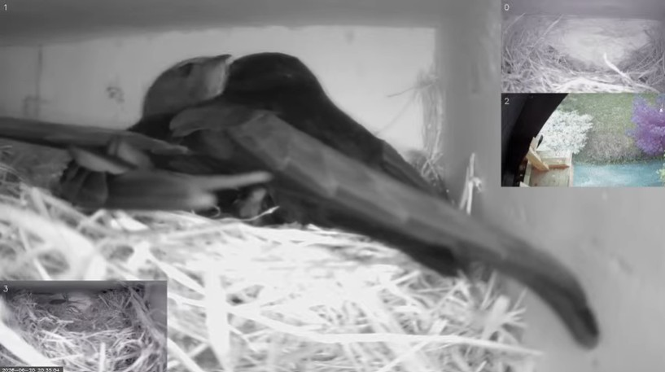

# multi_cam_streaming

Stream multiple camera feeds to YouTube in real-time. Supports USB, CSI, and other OpenCV-compatible cameras. Runs on Raspberry Pi, Linux, and Windows.

## Features

- **Multi-camera support** - Combine feeds from multiple cameras (USB, CSI, or any OpenCV-compatible source) into a single frame
- **YouTube streaming** - Stream directly to YouTube via RTMP
- **Live display** - View camera feeds locally with timestamp overlay
- **Configurable** - All settings via YAML configuration file
- **Flexible** - Easily adjust FPS, frame dimensions, and camera detection patterns

## Requirements

- Python 3.7+
- FFmpeg installed and in PATH
- v4l-utils (Linux/Raspberry Pi only, for camera detection)
- pygrabber (Windows only, for camera detection — installed automatically)
- Cameras supported by OpenCV (USB, CSI, IP cameras, etc.)

## Installation

See [INSTALLATION.md](docs/INSTALLATION.md) for detailed setup instructions.

Quick start:
```bash
pip install -r requirements.txt
cp config.example.yaml config.yaml
# Edit config.yaml with your camera patterns and YouTube stream key
```

## Usage

See [docs/USAGE.md](docs/USAGE.md) for full usage, configuration, troubleshooting, and systemd setup.

## License

This project is licensed under the MIT License - see [LICENSE](LICENSE) file for details.

## Author

Andreas Drollinger

## Real-World Use

This project is successfully used with 4 USB cameras on a Raspberry Pi 5 to observe Common Swift (*Apus apus*) nests. The motion-based layout automatically focuses on the most active nest camera, while the others appear as overlays.



## About

This project was largely "vibe coded" with the assistance of AI, leveraging its capabilities for rapid prototyping and code generation.

## Contributing

Contributions are welcome. Please feel free to submit a Pull Request.
